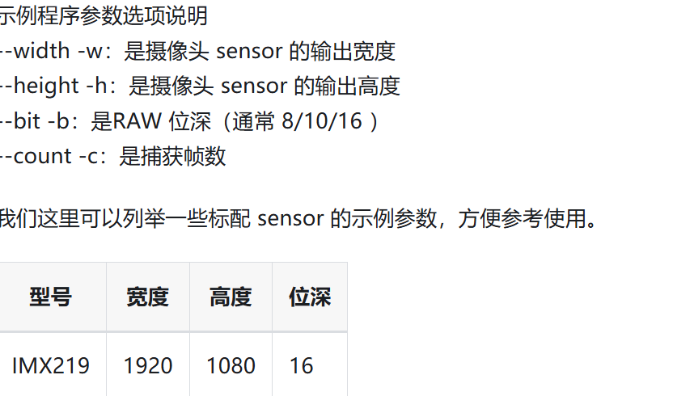
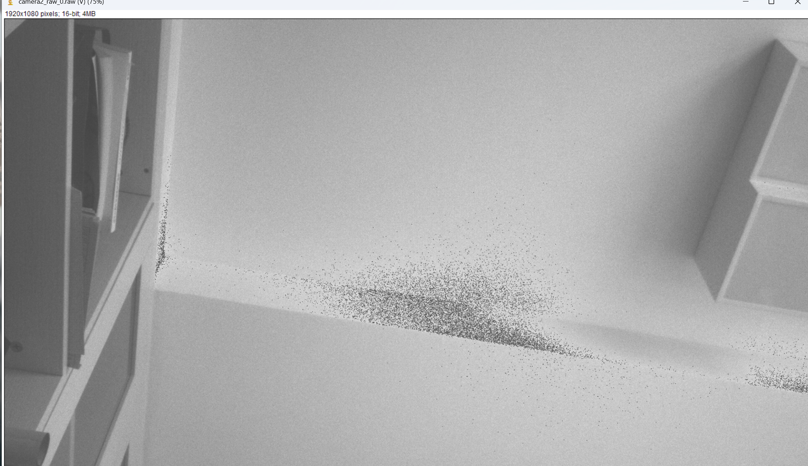
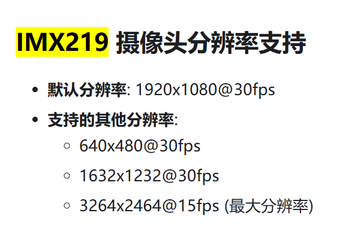

## 2.1
# vio 摄像头及参数配置

设置如上四个参数，并且mipi摄像头的参数也如上：

-width:1920
-height:1080
-bit:16
得到图片并保存


# vio 摄像头 SSH 实时显示实现
将原文件从c 改为 cpp， 并且在Makefile中链接opencv库
```shell
# 获取 OpenCV 编译选项
OPENCV_FLAGS := $(shell pkg-config --cflags --libs opencv4)

# 增加 -lstdc++ 因为使用了 C++
LDFLAGS := -lspcdev -lm -lstdc++ $(OPENCV_FLAGS)
```

下一步 采用双线程，并且利用板载VPS进行编码和缩放，减少CPU占用，加快速度

# 采用vps 进行编码和缩放
## opencv 方法如下:
```cpp
if (sp_vio_get_yuv(camera_1, yuv_ptr1, args.width, args.height, 2000) == 0 &&
            sp_vio_get_yuv(camera_2, yuv_ptr2, args.width, args.height, 2000) == 0) {
            
            
            // 2. 将原始内存包装成 OpenCV Mat (NV12 布局: 高度是 1.5 倍)
            Mat yuv_nv12_1(args.height * 1.5, args.width, CV_8UC1, yuv_ptr1);
            Mat yuv_nv12_2(args.height * 1.5, args.width, CV_8UC1, yuv_ptr2);

            Mat bgr_1, bgr_2;
            // 3. 颜色转换 NV12 -> BGR
            cvtColor(yuv_nv12_1, bgr_1, COLOR_YUV2BGR_NV12);
            cvtColor(yuv_nv12_2, bgr_2, COLOR_YUV2BGR_NV12);

            // 4. 重要：缩放以适应 SSH X11 转发带宽
            Mat small_1, small_2;
            resize(bgr_1, small_1, Size(640, 480));
            resize(bgr_2, small_2, Size(640, 480));

            // 5. 显示
            imshow("Camera 1 (RDK)", small_1);
            imshow("Camera 2 (RDK)", small_2);
        }
```
先测试当前的FPS效果:
**FPS: 3.78,FPS: 3.25, 总体来说 约3FPS左右，主要是其中的CPU进行了opencv 的双重resize操作导致的**

## 采用VPS进行测试
1. 在使用vps进行处理之后，get_frame失败 （采用配置高宽为0，也失败）
2. 使用统一句柄管理 也失败

**发现问题所在，vps是根据分辨率来区别的，但是我两张图片得到的分辨率一样，导致冲突，修改代码如下：**
```bash
flowid module cid chn FREE  REQ  PRO  COM USED
----------------------------------------------
0      vin0   0   0     16    0    0    0    0
0      vin0   0   8      0    1    2    0    0

0      isp0   0   0     13    0    0    0    3
0      isp0   0   8      0    3    0    0    0

0      vse0   0   0     13    0    0    0    3
0      vse0   0   8      0    1    0    2    0
0      vse0   0   9      0    1    0    2    0

1      vin2   0   0     16    0    0    0    0
1      vin2   0   8      0    1    2    0    0

1      isp0   1   0     13    0    0    0    3
1      isp0   1   8      0    3    0    0    0

1      vse0   1   0     13    0    0    0    3
1      vse0   1   8      0    1    0    2    0
1      vse0   1   9      0    1    0    2    0

2      vse0   2   0     16    0    0    0    0
2      vse0   2   8      0    3    0    0    0

3      vse0   3   0     16    0    0    0    0
3      vse0   3   8      0    3    0    0    0

========================= END ===========================

```
发现病根如下：
flow0/1 的COM 为2，说明已完成处理，并且isp也完成处理。
**但是可以观察 flow2/3 分配了16buffer，但是全是free，没有动，且没有占用，也就是说isp之后的硬件流无法到vps进行缩放处理</br>放弃VPS 直接使用原sensor降分辨率**
 
# 采用直接降分辨率方法

修改代码如下：
```cpp
// 打开摄像头 (管道0，camera0，一种分辨率图像）
    int ret_1 = sp_open_camera_v2(camera_1, 0, -1, 1, &parms, widths, heights);
    // 打开摄像头 (管道1，camera1，一种分辨率图像）
    int ret_2 = sp_open_camera_v2(camera_2, 1, -1, 1, &parms, widths, heights);
    if ( ret_1 != 0 || ret_2 != 0) {
        printf("Open camera failed\n");
        return -1;
    }

    sleep(2);

    // 分配缩放后的内存 (640x480)
    int scaled_yuv_size = FRAME_BUFFER_SIZE(args.width, args.height);
    char *scaled_ptr1 = (char *)malloc(scaled_yuv_size);
    char *scaled_ptr2 = (char *)malloc(scaled_yuv_size);

    //FPS测量
    double fps = 0.0;
    int frame_count = 0;
    int64 start_time = getTickCount();
    char fps_text[50];

    printf("Starting display... Press 'q' to exit.\n");

    while (1) {
        // 1. 得到处理后图像
        int r1 = sp_vio_get_frame(camera_1, scaled_ptr1, args.width, args.height, 2000);
        int r2 = sp_vio_get_frame(camera_2, scaled_ptr2, args.width, args.height, 2000);
        if(!r1&&!r2) {
            Mat yuv_nv12_1(args.height * 3 / 2, args.width, CV_8UC1, scaled_ptr1);
            Mat yuv_nv12_2(args.height * 3 / 2, args.width, CV_8UC1, scaled_ptr2);
            Mat bgr_1, bgr_2;
            // 2. 颜色转换 NV12 -> BGR
            cvtColor(yuv_nv12_1, bgr_1, COLOR_YUV2BGR_NV12);
            cvtColor(yuv_nv12_2, bgr_2, COLOR_YUV2BGR_NV12);
            // putText(bgr_1, fps_text, Point(20, 40), FONT_HERSHEY_SIMPLEX, 1.0, Scalar(0, 255, 0), 2);
            // putText(bgr_2, fps_text, Point(20, 40), FONT_HERSHEY_SIMPLEX, 1.0, Scalar(0, 255, 0), 2);
            imshow("Camera 1 (RDK)", bgr_1);
            imshow("Camera 2 (RDK)", bgr_2);
        }
        else{
            printf("Get frame failed! r1:%d r2:%d\n", r1, r2);
        }
         // 3. FPS 计算
        frame_count++;
        if(frame_count >= 30) {
            int64 current_time = getTickCount();
            fps = frame_count / ((current_time - start_time) / getTickFrequency());
            frame_count = 0;
            start_time = getTickCount();
            printf("FPS: %.2f\n", fps);
        // --- 将 FPS 绘制到画面上 ---
        // sprintf(fps_text, "FPS: %.2f", fps);
        // // 在左上角绘制文字 (图像, 文字, 位置, 字体, 大小, 颜色, 粗细)
        }
    }
```

**FPS只有4~5FPS，说明还是CPU占用过高，怀疑两个原因：</br>1.SSH 转发占用CPU</br>2.yuv转bgr占用cpu**

1. 关闭imshow，直接测试fps
**FPS提升到30FPS，说明SSH X11转发占用大量CPU资源**
2. 继续测试yuv转bgr，不进行颜色转换，也不显示图像
**FPS为30.21FPS，基本没有变化**</br>

**原因应该是，摄像头的极限帧率为30FPS，SSH转换占用大量CPU资源，导致帧率小于极限，而颜色转换占用较少CPU资源，对整体帧率影响不大。**


# 解决ssh转发但不影响帧率的做法
采用sp官方api自带的摄像头硬件拍摄缩放功能，得到640x480的图像，等待缩放； 再开启第二路320x240的图像，显示，能够保持fps在30帧左右，解决问题。