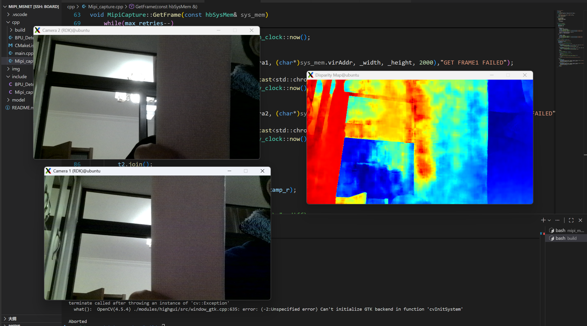

# 2.3 完成从mipi摄像头到视差图的过程

因为输入图像 不占用太多计算资源，因此我们仅观察是否ssh转发最后视差图的FPS即可。
1. 如果ssh转发最后视差图，FPS 为4左右
2. 如果不转发， FPS 可达8左右

效果如下图所示：


现在还有几个问题待做：
1. 曝光与白平衡不一致（AE/AWB Sync）从图中观察，Camera 1 的画面明显比 Camera 2 亮一些（看脸部和背景墙壁的亮度）。
</br>待做：
锁定参数：在程序启动稳定后，将两个相机的曝光时间和增益手动设为相同的值，或者使用 AE Sync（曝光同步） 功能。
色温锁定：将 AWB 设置为固定模式（如“日光”模式），确保色温一致。

2. 没有双线程采集

3. 未进行图像校正
</br>需要进行双目标定，获取内参和外参矩阵，进行图像校正。


## 先解决双线程采集

原代码：
```cpp
    CHECK_SUCCESS(sp_vio_get_frame(_camera1,(char*)sys_mem.virAddr , _width, _height, 2000),"GET FRAME1 FAILED");
    CHECK_SUCCESS(sp_vio_get_frame(_camera2,(char*)sys_mem.virAddr+_infer_size, _width, _height, 2000),"GET FRAME2 FAILED");
```

修改为双线程之后代码：
```cpp
int64_t timestamp_l, timestamp_r;
    bool synced = false;
    int max_retries = 5; // 如果时间对不上，最多尝试 5 次
    while(max_retries--)
    {
        auto start = std::chrono::high_resolution_clock::now();
        //双线程
        std::thread t1([&]() {
            CHECK_SUCCESS(sp_vio_get_frame(_camera1, (char*)sys_mem.virAddr, _width, _height, 2000),"GET FRAME1 FAILED");
            // 记录获取完成时的时间戳（单位：毫秒）
            timestamp_l = std::chrono::duration_cast<std::chrono::milliseconds>(
                              std::chrono::steady_clock::now().time_since_epoch()).count();
        });
        std::thread t2([&]() {
            CHECK_SUCCESS(sp_vio_get_frame(_camera2, (char*)sys_mem.virAddr + _infer_size, _width, _height, 2000),"GET FRAME2 FAILED");
            // 记录获取完成时的时间戳（单位：毫秒）
            timestamp_r = std::chrono::duration_cast<std::chrono::milliseconds>(
                              std::chrono::steady_clock::now().time_since_epoch()).count();
        });
        t1.join();
        t2.join();
       
        // 计算两路图像返回的时间差
        int64_t diff = std::abs(timestamp_l - timestamp_r);

        if (diff <= 5) {
            // printf("Frames Synced: Delta = %ld ms\n", diff);
            synced = true;
            break; // 成功找到同步帧，跳出循环
        } else {
            printf("Warning: Frames out of sync! Delta = %ld ms. Retrying...\n", diff);
            // 这里不需要显式释放，下次调用 sp_vio_get_frame 会自动覆盖旧数据
        }
        if (!synced) {
            printf("Final Warning: Proceeding with potentially unsynced frames after retries.\n");
        }
    }
    if(_show) {
        //显示图片
        cv::Mat bgr_1, bgr_2;
        std::thread ts1([&]() {
            CHECK_SUCCESS(sp_vio_get_frame(_camera1, _show_ptr1, _width_show, _height_show, 2000),"GET FRAME1 SHOW FAILED");
            cv::Mat yuv_nv12_1(_height_show * 3 / 2, _width_show, CV_8UC1, _show_ptr1);
            cvtColor(yuv_nv12_1, bgr_1, cv::COLOR_YUV2BGR_NV12);
            imshow("Camera 2 (RDK)", bgr_2);
        });
        std::thread ts2([&]() {
            CHECK_SUCCESS(sp_vio_get_frame(_camera2, _show_ptr2, _width_show, _height_show, 2000),"GET FRAME2 SHOW FAILED");
            cv::Mat yuv_nv12_2(_height_show * 3 / 2, _width_show, CV_8UC1, _show_ptr2);
            cvtColor(yuv_nv12_2, bgr_2, cv::COLOR_YUV2BGR_NV12);
            imshow("Camera 1 (RDK)", bgr_1);
        });
        ts1.join();
        ts2.join();    
    }
```

结果如下：


**可以看到，其实边缘的破碎感并没有明显改善，双线程的软件对齐并不是主要问题**

## 解决固定曝光和白平衡

在官方论坛中找到：</br>
**Linux 下几乎所有摄像头设备都支持 V4L2（Video for Linux 2） 接口，您可以使用命令行工具直接控制传感器参数。**

但是在hbn框架下，无法直接使用 v4l2-ctl 命令 来设置摄像头参数，因为摄像头设备被 hbn 框架占用。

打开之后
