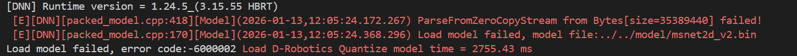
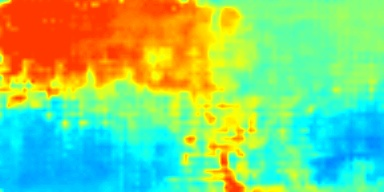
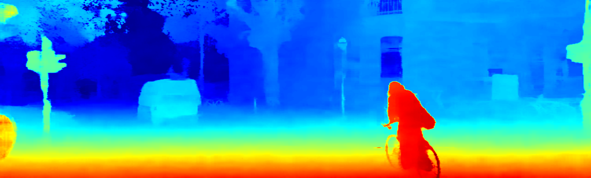
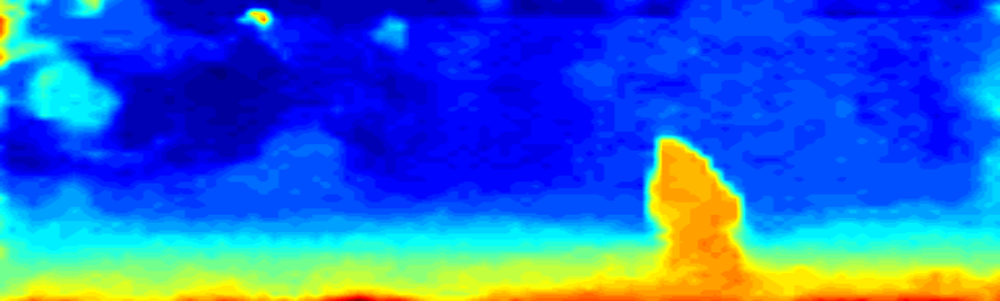
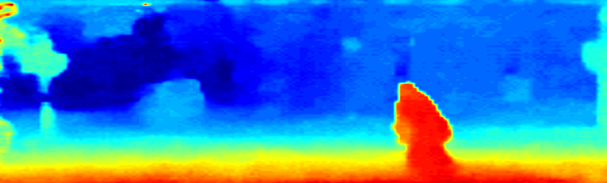

# 1.11 Windows ↔ ARM开发板 NFS双向共享配置日志

## 📋 项目简介
建立Windows 11与Ubuntu开发板之间的NFS双向文件共享，实现代码实时同步和远程编译调试。

## 🛠️ 环境信息
- **主机系统**: Windows 11
- **开发板**: Ubuntu 20.04 ARM64
- **网络环境**: 局域网192.168.127.x段
- **开发工具**: VS Code + Remote SSH扩展

---

## 🔧 配置过程

### 一、开发板NFS服务器配置
这一步是直接用vscode 的Remote-SSH连接到开发板之后可以直接编辑板载文件，就可以实现实时的调试和修改，不需要多余的复制功能。
#### 1. 安装NFS服务
```bash
# 1. 安装NFS服务
sudo apt update && sudo apt install nfs-kernel-server

# 2. 创建共享目录并配置
sudo mkdir -p /home/root/workspace
sudo chown root:root /home/root/workspace

# 3. 编辑/etc/exports，添加：
/home/root/workspace *(rw,sync,no_root_squash,insecure)

# 4. 重启服务
sudo systemctl restart nfs-kernel-server
```
#### 2. 配置ssh config
这里是为了方便使用Remote-SSH连接开发板，配置ssh的config文件。
编辑`~/.ssh/config`文件，添加以下内容：
```bash
Host github.com
    HostName github.com
    User git
    IdentityFile ~/.ssh/id_rsa

Host board
    HostName 192.168.127.10  # 改为你的开发板IP
    User root
    IdentityFile ~/.ssh/id_board
    StrictHostKeyChecking no
```

#### 3.Remote-SSH连接开发板
- 打开VS Code，安装Remote - SSH扩展。
- 使用Remote-SSH连接到`board`，即可直接编辑开发板上的文件。

### 二、Windows NFS服务端配置
#### 1. 下载了haneWin NFS服务端
- 下载地址: http://www.hanewin.net/nfs-e.html
- 下载了haneWIN NFS Server， 在里面配置到了nfs 共享目录的权限、路径和名字（msnet）
- 在windows客户端中重启nfs服务
- 防护墙开启nfs端口2049，111，1098端口
- rdk 挂载nfs目录
   ```shell
    mount -t nfs -o nolock <server_ip>:/msnet <local_mount_path>
   ```

==**这样就可以实验板载直接访问我通过nfs服务共享的目录，进行基础文件的拷贝和一些权重文件的拷贝（如果我实时更新的话，比ssh更方便）**==

## 问题待解决
- 板载loadmodel 出现问题：错误码-6000002，加载模型失败。查看论坛没有发现原因。
目前怀疑模型过大，下一步用小模型进行测试。



# 1.13 load 问题解决
## 问题描述
在ARM开发板上使用BPU_loadModel加载模型时，出现错误码-6000002，导致模型加载失败。
## 原因分析
错误模型文件为**33.75MB**,而能够加载的模型文件为**90MB**，这是奇怪的一点。<br />

针对这一点我去检查docker环境内输出的模型大小，发现错误模型文件的原始文件应该为**304MB**，而不是加载的这个文件，说明在ssh拷贝过程中出现了问题。<br />

然后我发现，在向板载nfs 传输这个模型文件的时候，它需要时间，如果中断传输，则这个模型文件就会停滞，也就是一个错误的文件，也就无法加载，所以不是模型文件过大的问题。
## 解决方案
- 确定文件传输过程完整，文件完整，这样加载就成功.<br />
记录加载时间 **21039.04ms = 21s**

- **640×352 $\rightarrow$ 384×192**
并重新生成了模型文件，成功解决了加载失败的问题.<br />
记录加载时间 **6590.84ms = 6.5s**


# 1.14 
## 内存空间占满导致功能失效
在解决上述问题时，我有想过是不是内存不够导致的模型加载失败，于是我增加了swap空间，将内存完全占满了。导致几个问题

-  内存占满，导致NTP服务崩溃：时间同步服务（ntpd、chronyd、systemd-timesyncd）需要内存运行。 **date**出现时间错误，导致makefile误检测，无法make
- 内存占满导致，我没法进行编译，和相关的编辑提示

## 进展
1. 基本写完整个C++推理流程，从LoadModel $\rightarrow$ GetModelInfo $\rightarrow$ Preprocess $\rightarrow$ Inference $\rightarrow$ Postprocess
2. 目前可以成功推理出结果，并保存为图片.但是推理数据不对. 输入不同的一组图片，输出类似于中间蓝，周围红 


# 1.20

## 尝试解决办法
1. 确定转换的初始onnx模型是否正常工作。   测试结果，转换的onnx模型能够正常推理
2. 查看bpu是否工作。   bpu处于工作状态，并且确实在利用bpu推理时利用率最高
3. 查看是否预处理完数据确实进入bpu。 更改了两张处理方式，一个是cut，一个是resize，**两个方式出来的图片一样，暂时怀疑是内存读写问题**。   不是内存读写问题，我打印了一些内存分配的偏置和校验和出来，确定缓存有读写
4. 重新转换模型，排除nv12的干扰


## 问题：
你的校准数据准备脚本与你的 config 配置文件之间存在 三重致命冲突：
1. 冲突 1：数值量程灾难（最严重）
    脚本逻辑：log_np = np.array(log).astype(np.float32) / 255.0。你把像素缩放到了 [0, 1] 之间。
    Config 配置：norm_type: 'data_mean_and_scale'，且 mean_value: 123.675...。
    后果：地平线工具链在量化校准时，会读取你的 .bin 文件，并根据配置执行减均值操作。
    计算公式变成了：( [0~1 之间的数] - 123.675 ) * 0.017。
    结果：网络输入的数值变成了 -2.1 左右的定值（正常的输入应该在 -2 到 +2 之间波动）。
    网络接收到的信号几乎全被“淹没”在 -2 附近的死区里，根本提取不出任何纹理，所以无论你输入什么，输出都是一堆无意义的噪点。
2. 冲突 2：内存排布（Layout）冲突
    脚本逻辑：log_np = log_np.transpose(2, 0, 1)。你保存的是 CHW 排布。
    Config 配置：input_layout_rt: 'NHWC'。
    后果：地平线量化工具在读取 .bin 文件时，会严格按照 input_layout_rt 指定的排布去解析。
    它以为内存里是 R,G,B,R,G,B...，但你给的是 所有R, 然后所有G, 然后所有B。
    这导致量化工具看到的图像是完全错位的“三色重叠怪”，计算出的量化参数（Scale/Offset）自然也是废的。
3. 冲突 3：颜色通道（RGB vs BGR）
    脚本逻辑：Image.open(...).convert('RGB')。
    Config 配置：input_type_rt: 'bgr'。
    后果：你的校准数据是 RGB，但模型在 RDK 上运行和校准时被告知输入是 BGR。

<mark>
1. 在修改时发现一个很严重的问题，在处理校准数据时，一定要保证config中的校准数据和我随机选取的校准数据格式相同,例如图片格式为uint8，而不是float</br>
2. 同时 在保存之后因为，bmp或者png文件头的原因，会导致字节数不对，这个时候可以添加,他会自动处理文件头字节来对齐校准数据
3. 同时取消了校准数据时的 /255 ，这样会导致信号淹没，因为我本身config里面就开启了预处理，模型文件为msnet2d_bgr_192×384_new.bin

```bash
    preproccess_on: True 
```

</mark>

1. 按照以上修改之后，第一张图的结果如下：
 


# 1.26
2. 并且我排除了letterbox的方法影响，只用cut的数据集来校准，效果还是无法明确看出

3. 先排除模型文件的影响，采用 官方模型文件“DStereoV2.6_int8.bin”进行测试，官方(640×352)和msnet(384×192)、msnet(684×384)均采用resize处理，结果如下,成功实现板载推理：



 
并且官方每个阶段的推理时间如下：</br>

<mark>

        1. Load D-Robotics Quantize model time = 262.11 ms
        
        2.  GetModelInfo and allocate mem time = 0.48 ms

        3.  Preprocess time = 97.04 ms

        4. Inference time = 36.93 ms

        5. Postprocess time = 63.57 ms


</mark>
